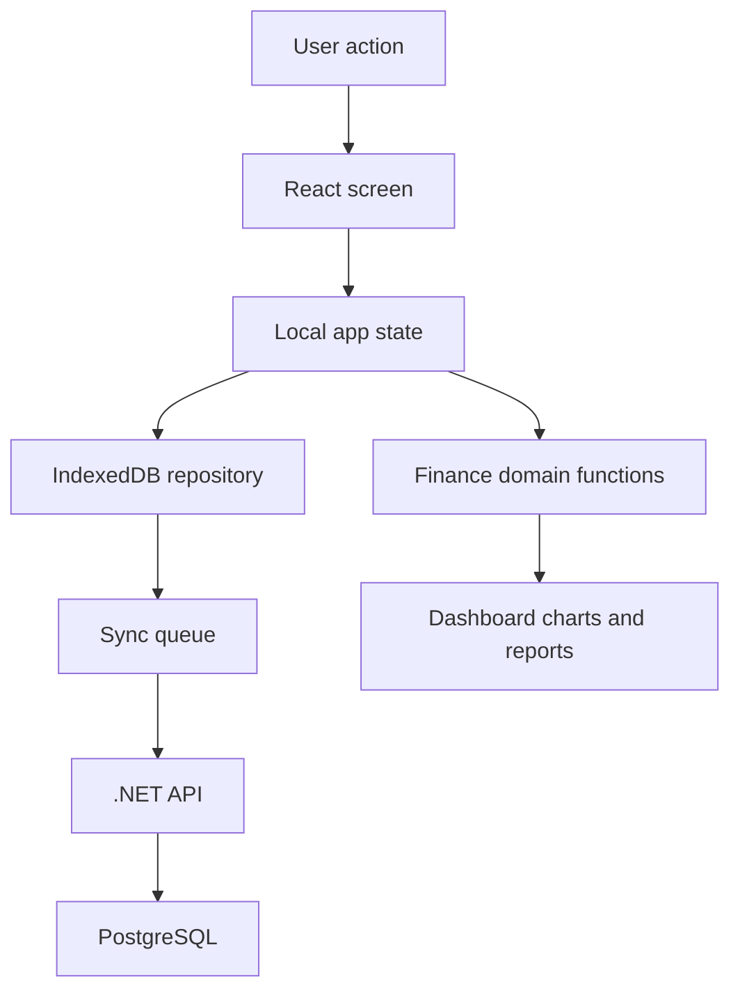

# MVP Offline-First Design

**Spec**: `.specs/features/mvp-offline-first/spec.md`
**Status**: Draft

---

## Architecture Overview

Poupa+ starts as a full-stack offline-first product. The React PWA keeps a local IndexedDB copy so the user can keep working offline, while the .NET API owns the server contract and PostgreSQL is the durable server database. Domain functions remain pure and testable on both sides where practical.



---

## Code Reuse Analysis

### Existing Components to Leverage

| Component | Location | How to Use |
| --- | --- | --- |
| None | Greenfield project | Establish small, typed components and pure domain functions. |

### Integration Points

| System | Integration Method |
| --- | --- |
| IndexedDB | Dexie database wrapper in `src/data/db.ts`. |
| .NET API | Minimal API endpoints in `backend/PoupaPlus.Api`. |
| PostgreSQL | Docker service and schema foundation for future durable sync. |
| PWA | Vite PWA plugin in `vite.config.ts`. |
| Backend sync | Sync queue model in local DB, adapter boundary in `src/data/sync.ts`. |

---

## Components

### App

- **Purpose**: Owns session state and renders login or finance workspace.
- **Location**: `src/App.tsx`
- **Interfaces**:
  - `loadSession(): Promise<UserProfile | null>`
  - `saveSession(profile: UserProfile): Promise<void>`
- **Dependencies**: Local repository, React state.
- **Reuses**: None.

### Dashboard

- **Purpose**: Shows monthly totals, report summary, chart toggle, goals, and sync status.
- **Location**: `src/features/dashboard/Dashboard.tsx`
- **Interfaces**:
  - `transactions: Transaction[]`
  - `categories: Category[]`
  - `syncItems: SyncQueueItem[]`
- **Dependencies**: Domain summary functions and Recharts.
- **Reuses**: Domain functions from `src/domain/finance.ts`.

### TransactionForm

- **Purpose**: Captures income, fixed expenses, and variable expenses.
- **Location**: `src/features/transactions/TransactionForm.tsx`
- **Interfaces**:
  - `onSubmit(input: TransactionInput): Promise<void>`
- **Dependencies**: Category list and validation.
- **Reuses**: Types from `src/domain/types.ts`.

### LocalFinanceRepository

- **Purpose**: Persists profiles, transactions, categories, goals, predictable income, and sync queue items in IndexedDB.
- **Location**: `src/data/db.ts`
- **Interfaces**:
  - `getSnapshot(userId: string): Promise<FinanceSnapshot>`
  - `addTransaction(input: Transaction): Promise<void>`
  - `enqueueSync(item: SyncQueueItem): Promise<void>`
- **Dependencies**: Dexie.
- **Reuses**: Domain types.

### PoupaPlus API

- **Purpose**: Provides the server contract for health checks, local/demo auth, transactions, and monthly summaries.
- **Location**: `backend/PoupaPlus.Api/`
- **Interfaces**:
  - `GET /api/health`
  - `POST /api/auth/local`
  - `GET /api/transactions`
  - `POST /api/transactions`
  - `GET /api/summaries/monthly`
- **Dependencies**: ASP.NET Core and PoupaPlus.Domain.
- **Reuses**: Domain records and finance calculator.

### PostgreSQL Database

- **Purpose**: Durable server-side store for users, categories, transactions, goals, predictable income, and sync items.
- **Location**: `docker-compose.yml`, `database/schema.sql`
- **Interfaces**:
  - Connection string: `Host=localhost;Port=5432;Database=poupa_plus;Username=poupa;Password=poupa_dev`
- **Dependencies**: PostgreSQL container.
- **Reuses**: Domain model names and IDs.

---

## Data Models

```typescript
type TransactionKind = 'income' | 'fixed_expense' | 'variable_expense'

interface UserProfile {
  id: string
  name: string
  email: string
  createdAt: string
}

interface Category {
  id: string
  userId: string
  name: string
  color: string
}

interface Transaction {
  id: string
  userId: string
  kind: TransactionKind
  description: string
  amount: number
  categoryId?: string
  occurredAt: string
  createdAt: string
}

interface Goal {
  id: string
  userId: string
  kind: 'saving' | 'debt'
  name: string
  targetAmount: number
  currentAmount: number
}

interface PredictableIncome {
  id: string
  userId: string
  description: string
  amount: number
  frequency: 'monthly'
}

interface SyncQueueItem {
  id: string
  userId: string
  entity: 'transaction' | 'category' | 'goal' | 'predictable_income'
  entityId: string
  operation: 'create' | 'update' | 'delete'
  status: 'pending' | 'synced' | 'failed'
  createdAt: string
}
```

**Relationships**: All v1 data belongs to one `UserProfile`. Later household sharing can add `householdId` without changing the basic transaction/category shape.

---

## Error Handling Strategy

| Error Scenario | Handling | User Impact |
| --- | --- | --- |
| Invalid transaction form | Inline validation before persistence | User sees what to fix. |
| Empty dashboard data | Zero totals and empty chart state | App remains useful on first run. |
| Offline status | Save locally and mark sync item pending | User keeps working. |
| IndexedDB failure | Show recoverable error banner | User knows data was not saved. |

---

## Tech Decisions

| Decision | Choice | Rationale |
| --- | --- | --- |
| Local DB | Dexie/IndexedDB | Strong browser storage fit for offline-first PWA. |
| Server stack | .NET Web API | Typed, testable backend with clear evolution path for auth and sync. |
| Server DB | PostgreSQL | Reliable relational store for financial records and future sharing. |
| Charts | Recharts | Fast MVP path for pie and treemap with React. |
| Auth | Local demo session facade | Satisfies portfolio MVP while leaving backend auth replaceable. |
| Tests | Vitest + Testing Library | Lightweight Vite-native TDD path. |
