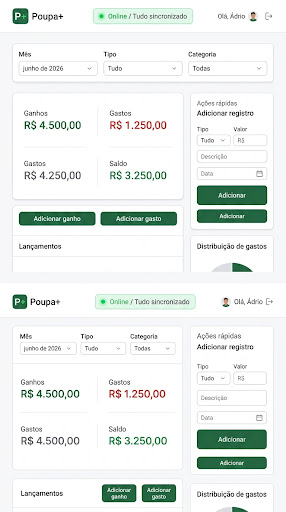
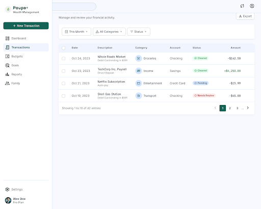
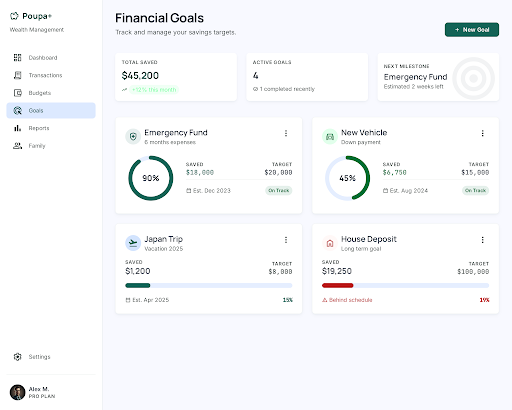
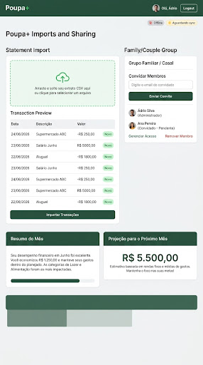

# Poupa+

Poupa+ is a personal finance MVP focused on offline-first usage, API synchronization, and simple organization of goals, transactions, categories, and household groups.



## About the project

Poupa+ combines a React web interface with a .NET API and PostgreSQL persistence. The application is organized to work well both in local development and in a fully containerized setup, which makes MVP demos, validation, and onboarding much easier.

### Current core capabilities

- Local user registration and login
- Transaction creation and listing
- Categories, goals, and predictable incomes
- Household groups and basic sharing
- API synchronization
- PWA structure with IndexedDB for offline-first support

## Technologies

These are the main technologies used in the project:

- Frontend: React 18, TypeScript, Vite, and PWA
- Backend: .NET 10 Minimal API
- Database: PostgreSQL 17
- Local persistence: IndexedDB with Dexie
- Charts: Recharts
- Containers: Docker and Docker Compose
- Testing: Vitest and xUnit

## Stack services

- `frontend`: web application served by Nginx
- `api`: .NET API for authentication, synchronization, and finance domain logic
- `db`: PostgreSQL with initial schema in `database/schema.sql`

## Running with Docker

Dependencies:

- Docker Desktop
- Docker Compose

To build and start the full stack:

```powershell
docker compose up -d --build
```

Local endpoints:

- Frontend: `http://localhost:8080`
- API health: `http://localhost:5254/api/health`
- PostgreSQL: `localhost:5432`

To follow logs:

```powershell
docker compose logs -f
```

To stop the containers:

```powershell
docker compose down
```

## Running locally without Docker

### Database

```powershell
docker compose up -d db
```

### Backend

```powershell
dotnet test backend/PoupaPlus.slnx
dotnet run --project backend/PoupaPlus.Api/PoupaPlus.Api.csproj
```

### Frontend

```powershell
cd frontend
npm install
npm run dev
```

## Quality

Main project checks:

```powershell
cd frontend
npm run lint
npm test -- --run
npm run build

cd ..\backend
dotnet test PoupaPlus.slnx
dotnet build PoupaPlus.Api\PoupaPlus.Api.csproj
```

## MVP screens

### Dashboard


### Transactions



### Goals



### Sharing and household groups



## Repository structure

```text
backend/   .NET API, domain, and tests
frontend/  React PWA application
database/  PostgreSQL schema
docs/      Functional documentation when available
.specs/    Project and feature specifications
```

## Links

- Repository: this local project will be published to GitHub as an MVP
- Docker Compose: [`docker-compose.yml`](./docker-compose.yml)
- Initial schema: [`database/schema.sql`](./database/schema.sql)

## Version

`0.1.0`

## Author

Poupa+ project in MVP stage.
